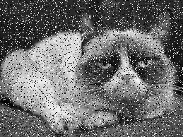
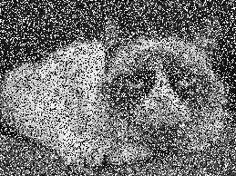
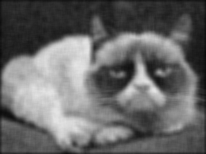
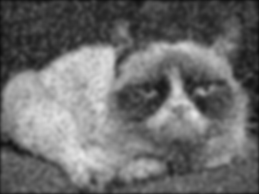
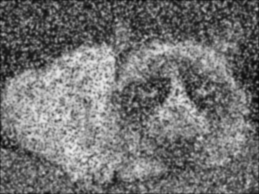

# Rapport TP5 P4y

&nbsp;

# Filtre médian

On crée une fonction *median* dédiée aux filtres médians prenant en paramètres les noms d'images d'entrée et de sortie ainsi que la taille n du filtre à appliquer.

On y parcourt chaque pixel de l'image à l'aide d'une double boucle (i et j). Puis, on parcourt les voisins de notre pixel avec une seconde double boucle (k et l) selon la taille du voisinage. Les positions des voisins sont définis à l'aide de *i + k - (n/2)* et *j + l - (n/2)*. Les valeurs des pixels voisins sont elles, stockées dans un vecteur.

    std::vector<uint8_t> voisins;

On vérifie alors si le voisin courant est un point de l'image, en regardant si ces coordonnées sont comprises entre 0 et le nombre de colonnes/lignes. Si tel est le cas, on stocke la valeur du voisin dans le vecteur à l'aide de la méthode *push_back*.

    voisins.push_back(image(posX_voisin,posY_voisin));

Une fois les valeurs de tous nos voisins récupérés pour le pixel courant, on les trie de manière croissante avec l'instruction *sort*.

    std::sort(voisins.begin(),voisins.end());

Enfin, on récupère la médiane des valeurs voisines pour en faire la nouvelle valeur à notre pixel et on vide notre vecteur pour passer au prochain point de l'image.

Voici ci-dessous une illustration de l'effet de notre filtre résultant d'un test demandé plus bas.

| Bruit impulsionnel de 15% | Débruitage avec filtre médian de taille 3 | Débruitage avec f filtre médian de taille 7 |
|:-------------------------:|:-----------------------------------------:|:-------------------------------------------:|
|  |  |  |

&nbsp;
_____________________

&nbsp;

# Modélisation du bruit

## Bruit impulsionnel

On crée une fonction *bruit_impuls* prenant en paramètres les noms d'images d'entrée et de sortie ainsi que la probabilité *p* pour qu'un pixel de l'image soit corrompu.

On y parcourt chaque pixel de l'image à l'aide d'une double boucle (i et j). Puis, on tire au sort un entier entre 0 et 99 à l'aide la fonction *rand()*.

    int random = rand() % 100;

On compare alors *p* et *random* en multipliant *p* par 100. Si *random* est plus petit ou égal à *p*, alors le pixel va subir du bruit, sinon sa valeur reste intacte. 

On tire alors à nouveau un chiffre à l'aide de *random()*, cette fois-ci avec donc un %2 et non %100. Si le résultat du tirage est 0, le pixel deviendra noir, autrement le résultat vaudra 1 et le pixel prendra la couleur blanche.

Le résultat donné par notre fonction de bruit impulsionnel se trouve ci-dessous.

| Image originale | Bruit impulsionnel de 15% | Bruit impulsionnel de 40% |
|:-----------:|:------------:|:---------------:|
|  |  |  |

&nbsp;

## Bruit gaussien

On crée une fonction *bruit_gauss* prenant en paramètres les noms d'images d'entrée et de sortie ainsi que la moyenne *mu* et l'écart-type *sigma* de la loi de probabilité gaussienne.

On y parcourt chaque pixel de l'image à l'aide d'une double boucle (i et j). Puis, on tire au sort un entier à l'aide d'une distribution normale. C'est pourquoi, nous n'utilisons pas la fonction *rand()* comme pour le bruit impulsionnel, mais une instance de la classe *normal_distribution*.

    std::default_random_engine generator;
    std::normal_distribution<double> distribution(mu,sigma);

Ce qui nous amène à générer un nombre aléatoire pour chaque pixel de la manière suivante :

    double rand_val = distribution(generator);

Le bruit résulte alors d'une simple addition entre la valeur aléatoire *rand_val* et le niveau de gris initial du pixel. On doit alors faire attention à ne pas sortir des bornes 0 et 255.

Comme on travaille sur des uint8_t, les bornes de nos valeurs sont déjà 0 et 255, on ne peut donc pas faire les vérifications avec un test après avoir calculé la valeur de sortie. En effet, le problème est qu'en ajoutant par exemple 1 à 255, le résultat sera non pas 256, mais 0. Le pixel passe alors du blanc au noir ce qui fait une corruption beaucoup top grande comparer à la différence de seulement 1 niveau de gris attendue.

Pour pallier à cela, dans nos tests de bornes, on cast les valeurs de nos pixels en int, afin d'avoir une plage de valeur plus grande et qui peut prendre aussi des valeurs négatives.

    if( (int)image(i,j) + rand_val < 0){
        image_sortie(i,j) = 0;
    }
    else if ( (int)image(i,j) + rand_val > 255) {
        image_sortie(i,j) = 255;
    }
    else {
        image_sortie(i,j) = image(i,j) + rand_val;
    }

Enfin, on convertit notre image de double en uint8_t.

Le résultat donné par notre fonction de bruit gaussien se trouve ci-dessous.

| Image originale | Bruit gaussien de moyenne μ=0 et d'écart-type σ=15 | Bruit gaussien de moyenne μ=0 et d'écart-type σ=30 |
|:------:|:---------:|:----------:|
|  |  |  |

&nbsp;
_____________________

&nbsp;

# Mean Square Error

On crée une fonction *computeMSE* prenant en paramètre les noms de deux images dont on veut calculer la dissimilarité à l'aide de la MSE.

On y parcourt chaque pixel de l'image à l'aide d'une double boucle (i et j). Puis, on élève au carré, la différence de niveau de gris du même point sur les 2 images à comparer. On fait donc la somme de cette différence au carré en chaque pixel.

     mse += pow(image(i,j) - image_sortie(i,j),2);

Enfin, on divise le résultat par le nombre de pixels que contiennent nos images et on affiche le résultat sur la console.

&nbsp;
_____________________

&nbsp;

# Main

Nos différentes fonctions utilisant des paramètres différents, on se sert d'un switch pour lancer facilement la fonctionnalité souhaitée depuis la console. 

En c++ les switch ne se faisant que sur des entiers, on associe un chiffre à chacun des programmes. 1 pour lancer le filtre médian, 2 pour la corruption par du bruit impulsionnel, 3 pour l'application d'un bruit gaussien et 4 pour le calcul de MSE entre deux images. Si autre chose est entré par l'utilisateur, on lui affiche cette correspondance nombre/fonction.

&nbsp;
_____________________

&nbsp;

# Tests

En premier lieu, voici des tableaux récapitulant toutes les images générées lors des tests :

## Filtre médian

|  | Image bruitée | Image débruitée : taille 3 | Image débruitée : taille 7 |
|:--:|:--:|:--:|:--:|
|**Bruit impulsionnel 15%**|  |  | | 
|**Bruit impulsionnel 40%**|  |  |  |
|**Bruit gaussien σ=15**|  |  |  |
|**Bruit gaussien σ=30**|  |  |  |

&nbsp;

## Filtre moyenneur

|  | Image bruitée | Image débruitée : taille 3 | Image débruitée : taille 7 |
|:--:|:--:|:--:|:--:|
|**Bruit impulsionnel 15%**|  |  | |
|**Bruit impulsionnel 40%**|  |  | |
|**Bruit gaussien σ=15**|  |  |  |
|**Bruit gaussien σ=30**|  |  |  |

&nbsp;

## Filtre gaussien

|  | Image bruitée | Image débruitée : σ=1 | Image débruitée : σ=2 |
|:--:|:--:|:--:|:--:|
|**Bruit impulsionnel 15%**|  |  |  |
|**Bruit impulsionnel 40%**|  |  |  |
|**Bruit gaussien σ=15**|  |  |  |
|**Bruit gaussien σ=30**|  |  |  |

&nbsp;

## MSE

Enfin voici le tableau des différents MSE représentant la disparité de chaque image par rapport à celle de départ. Le résultat en gras pour chaque ligne correspond au filtre offrant le meilleur débruitage.

|  | Image bruitée | Median taille 3 | Median taille 7 | Moyenneur taille 3 | Moyenneur taille 7 | Gaussien σ=1 | Gaussien σ=2 |
|:--:|:--:|:--:|:--:|:--:|:--:|:--:|:--:|
| **Bruit impulsionnel 15%** | 3339 | **90**   | 141 | 534  | 366  | 442  | 336  |
| **Bruit impulsionnel 40%** | 8424 | 1041 | **164** | 1624 | 1013 | 1404 | 1001 |
| **Bruit gaussien σ=15**    | 222  | 99   | 142 | 93   | 184  | **82**   | 149  |
| **Bruit gaussien σ=30**    | 830  | 216  | 171 | 161  | 198  | **133**  | 164  |